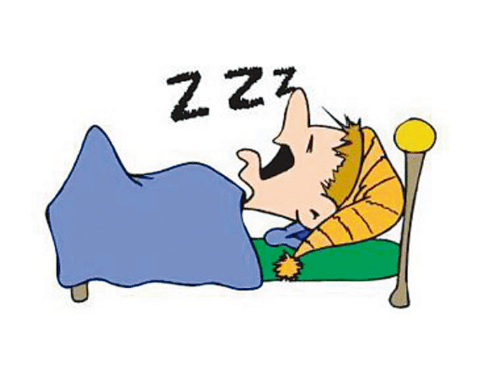
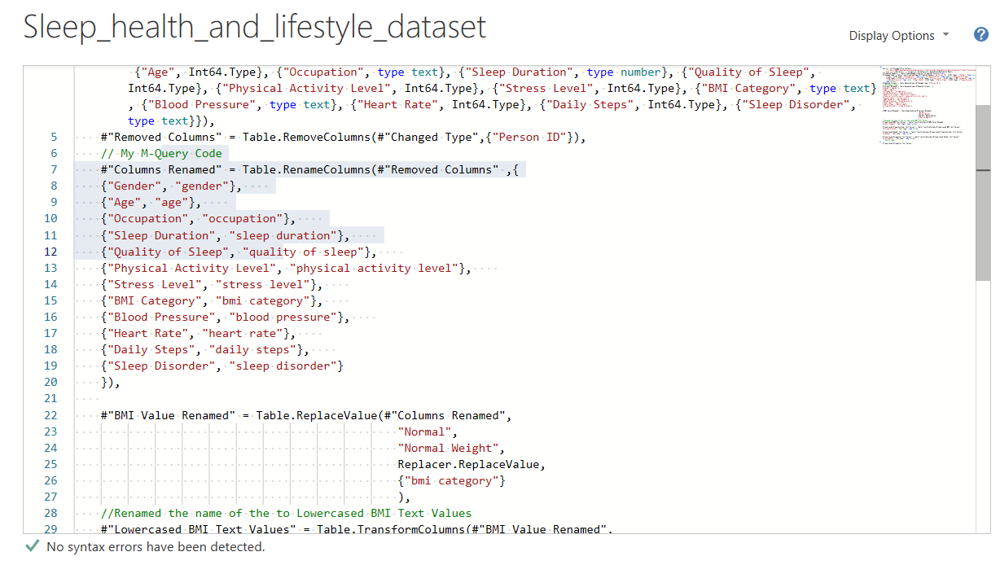
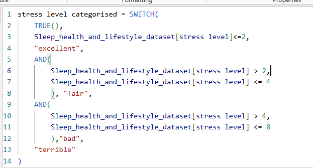
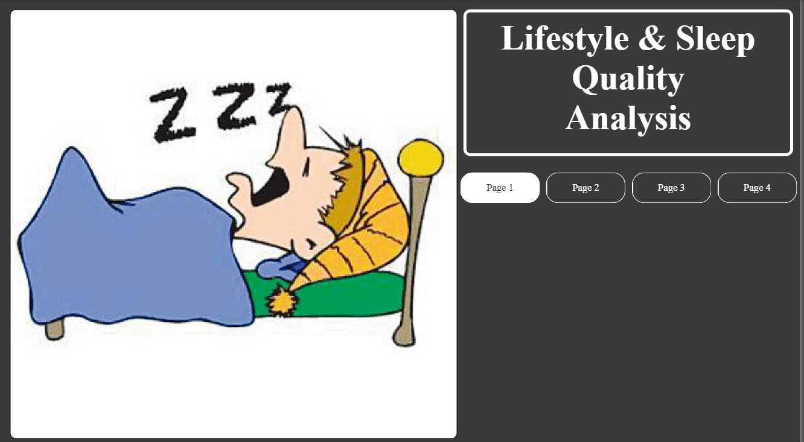
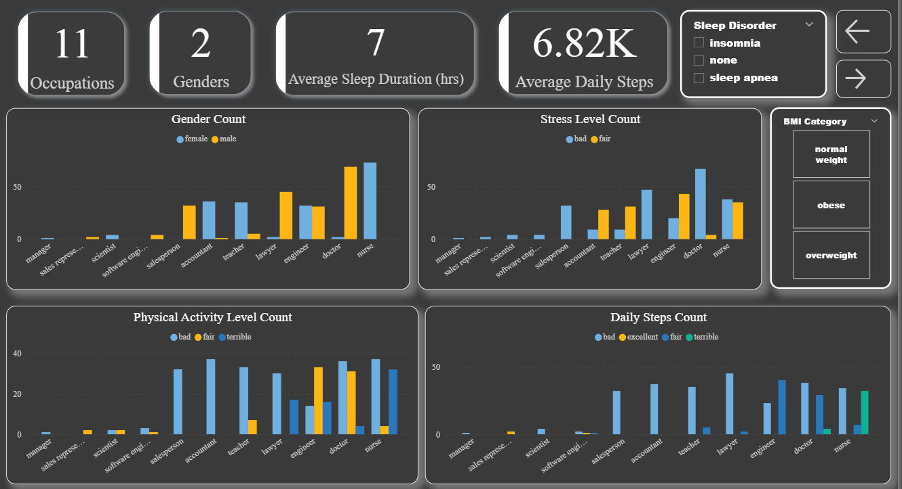
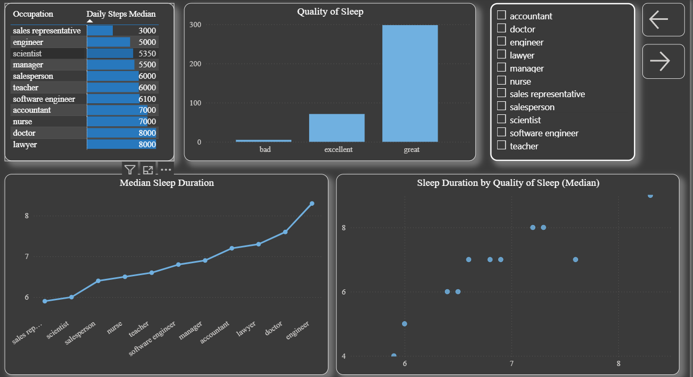
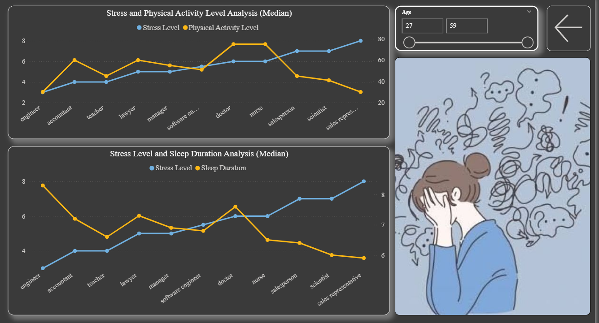

# Lifestyle & Sleep Analysis
Analysis of Lifestyle and Sleep Patterns


The project aims at using Powerbi for data preparation, feature engineering and visual analytics for drawing insights from [Kaggle](https://www.kaggle.com/datasets/0f4b0b774a1d5081623fff75b135ba81e682bb64f9b9bc2edba1bdd703c66977).

## Data Analytics Procedure
Steps for this involved the following;
- Loading the data into PowerBI
- Transform the dataset using PowerQuery & M-Query
- Feature engineering using DAX
- Create visuals and draw insights

### M-Query
M-Query, the language that powers PowerQuery was used for the cleaning of the dataset. It gives a finer and deeper control of the data preprocessing. Below is a sample code from the project
```
#"Columns Renamed" = Table.RenameColumns(#"Removed Columns" ,{
    {"Gender", "gender"},    
    {"Age", "age"},    
    {"Occupation", "occupation"},    
    {"Sleep Duration", "sleep duration"},    
    {"Quality of Sleep", "quality of sleep"},    
    {"Physical Activity Level", "physical activity level"},    
    {"Stress Level", "stress level"},    
    {"BMI Category", "bmi category"},    
    {"Blood Pressure", "blood pressure"},    
    {"Heart Rate", "heart rate"},    
    {"Daily Steps", "daily steps"},    
    {"Sleep Disorder", "sleep disorder"}
    }),
```



The **Table.RenameColumns** function was used to rename all columns, it expects the following; previous table procedure and a dictionary for renaming the columns.

### DAX
```
stress level categorised = SWITCH(
    TRUE(),
    Sleep_health_and_lifestyle_dataset[stress level]<=2,
    "excellent",
    AND(
        Sleep_health_and_lifestyle_dataset[stress level] > 2,
        Sleep_health_and_lifestyle_dataset[stress level] <= 4
        ), "fair",
    AND(
        Sleep_health_and_lifestyle_dataset[stress level] > 4,
        Sleep_health_and_lifestyle_dataset[stress level] <= 8
        ),"bad",
    "terrible"
)
```


In above code, the stress level categorised is created using the stress level column from the dataset. The switch statement was used to easily map the strings to the numerical values in the newly calculated column by using the condition given.

Most of the feature engineered columns were based off some research (Google is still your best friend) done.

## Insights Drawn
1. Occupational diversity: The data covers 11 occupations with varying sleep, stress, and activity patterns across both genders.
2. General lifestyle trends: Average sleep duration is around 7 hours, with 6.8K average daily steps and mostly great sleep quality.
3. Role-specific sleep patterns: Engineers sleep the longest with low stress, while sales representatives sleep the least and experience high stress.
4. Physical activity contrast: Nurses and doctors show the highest physical activity, while engineers and sales representatives exhibit low levels.
5. Stress and sleep correlation: Higher stress generally aligns with shorter sleep duration (notably in sales reps and nurses).
6. Sleep disorders: Insomnia is seen in 11 occupations, especially among male salespersons and female teachers, often linked to high stress and poor activity levels.
7. Sleep apnea trends: Found in 8 occupations, with female nurses showing bad physical activity and bad stress levels.
8. BMI-related patterns: Overweight and obese doctors and nurses exhibit bad physical activity and fair stress levels.
9. Quality vs. quantity: While sleep quality is generally good across jobs; sales representatives uniquely report bad sleep quality and engineers report excellent sleep duration and quality.
10. Stress dynamics: Physical activity does not always lower stress (e.g., sales reps), whereas higher sleep duration (e.g., engineers) is consistently linked to lower stress.






Publications:
[Medium](https://www.kaggle.com/datasets/0f4b0b774a1d5081623fff75b135ba81e682bb64f9b9bc2edba1bdd703c66977).
